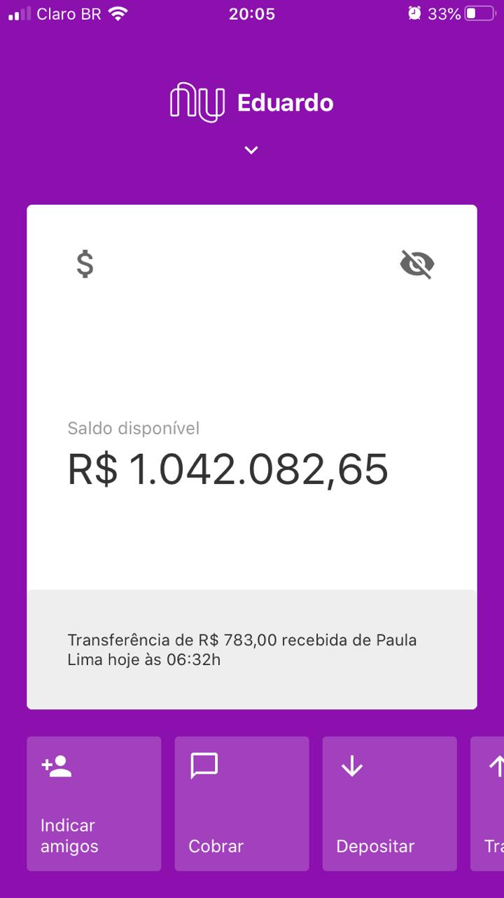

# Nubank Clone
As a tribute to Nubank, a company that reinvented the banking industry, I recreated the homepage of the mobile application
with React Native 💜

# Technologies
- React Native
- React Navigation
- Expo CLI
- Styled Components
- React Native QRCode SVG
- Animated - lib to handle with animations
- Yarn - package manager

# How-To
If you're wondering how you can start using this React Native template, dont't worry because it's really simple. However there are some
required tools you need to install first:

- Yarn - This is a package manager to get all required dependencies used on this project. NPM also works, so it's up to you!
- Expo Client - Install this app on your cellphone. It is available on Play Store (Android) and App Store (iOS). You will need it to
emulate Nubank clone.
- Visual Studio Code (IDE) - Download VS Code as your IDE or choose one that you enjoy the most  🙂

Once you've already downloaded this repository, access it's directory via prompt and run `yarn install` command, which is responsible to
get the dependencies this project uses.
  
Now run `yarn start` to start the application. A new window will be opened on your default browser.
  
Scan the QR Code on the left bottom side of the web page with you cellphone camera.
  
A notification will appear on your cellphone screen, requesting you to open it on <b>Expo Client</b> app.
  
Just wait a few seconds to download all the depencencies and then you're done ✅ Hope you enjoy it.

# Preview
This is how Nubank clone looks like 😊

  

